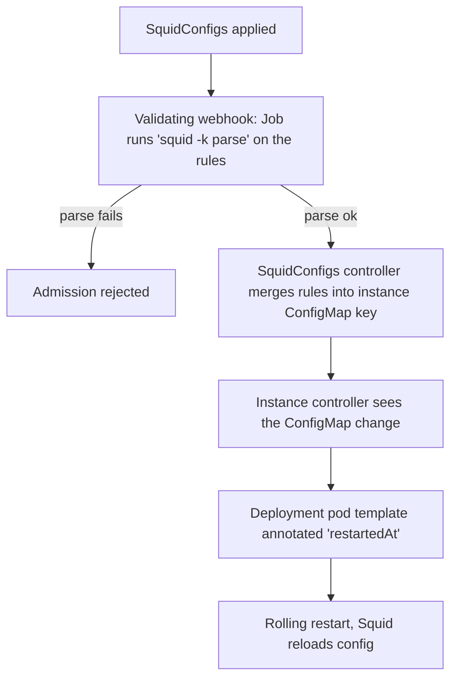

# squid-operator

Kubernetes operator that deploys and manages [Squid](http://www.squid-cache.org/) forward-proxy
instances from custom resources, and lets the proxy configuration be composed from many small,
independently-owned pieces instead of one monolithic `squid.conf`.

Built with [Kubebuilder](https://book.kubebuilder.io/) v4 / controller-runtime.
API group: `squid.cdk.clara.net/v1`.

- Documentation site: [docs/](docs/) (MkDocs Material, published to GitLab Pages from `main`)
- Repository: <https://git.fr.clara.net/claranet/healthcare/buildops/projects/kubernetes/operators/squid-operator>

## Why

Squid configuration in a shared cluster tends to be owned by several teams: one wants an ACL for its
CI runners, another a cache directive, another a proxy peer. Editing a single ConfigMap by hand makes
those changes conflict and unreviewable.

This operator splits the problem in two:

- **`SquidInstance`** — the runtime: how many replicas, which image, which storage class. Owned by
  the platform team.
- **`SquidConfigs`** — a fragment of `squid.conf`. Any number of them can point at the same instance;
  the operator merges each into a separate key of the instance's ConfigMap and rolls the Deployment
  so Squid picks it up. Owned by whoever needs the rule.

## Custom resources

### SquidInstance

```yaml
apiVersion: squid.cdk.clara.net/v1
kind: SquidInstance
metadata:
  name: squid-sample
  namespace: healthcare-tools
spec:
  replicas: 3
  image:
    repository: ubuntu/squid # defaulted by webhook
    tag: latest             # defaulted by webhook
  storageClassName: standard # defaulted by webhook; must support ReadWriteMany
```

| Field | Required | Notes |
| --- | --- | --- |
| `spec.replicas` | yes | Deployment replica count. |
| `spec.image.repository` / `spec.image.tag` | yes | Defaulted to `ubuntu/squid:latest` by the mutating webhook. Also used as the image of the validation Job (see below). |
| `spec.storageClassName` | yes | Defaulted to `standard`. Backs the log volume; the PVC is created `ReadWriteMany` / `10Gi`. |
| `spec.hpaSpec` | no | Present in the API but **not reconciled yet** — declaring it has no effect. |

Status: `status.health` (`Done` / `Error`) and `status.loadBalancer`, mirrored from the Service once
the load balancer reports an address.

The instance controller owns — all named after the SquidInstance, in the same namespace:

| Resource | Detail |
| --- | --- |
| `Deployment` | Squid container, port `3128` (`http`), TCP liveness + readiness probes on that port. |
| `ConfigMap` | Mounted at `/etc/squid/conf.d/`. Seeded with `squid-init.conf`; every other key comes from a `SquidConfigs`. |
| `PersistentVolumeClaim` | Mounted at `/var/log/squid`. |
| `Service` | Type `LoadBalancer`, port `3128`. |
| `ServiceAccount` | Used by the pods. |

The ConfigMap and the PVC are created but never overwritten on update — that is deliberate, it is
what keeps the merged rules and the logs from being wiped on every reconcile. A finalizer
(`squid.ckd.clara.net/finalizer`) deletes the five resources before the instance goes away.

### SquidConfigs

```yaml
apiVersion: squid.cdk.clara.net/v1
kind: SquidConfigs
metadata:
  name: debian-default
  namespace: healthcare-tools
  annotations:
    squid.ckd.clara.net/instance: squid-sample # target SquidInstance, same namespace
spec:
  rules: |
    logfile_rotate 0
    http_access allow localnet
```

- The target instance is selected by the **`squid.ckd.clara.net/instance` annotation**, not by a spec
  field. It must name a `SquidInstance` in the same namespace. Missing annotation ⇒ rejected.
  (Note the `ckd` spelling — it does not match the `cdk.clara.net` API domain, but it is what the
  code reads, in the controller, the webhook and the finalizer alike.)
- `spec.rules` lands in the instance ConfigMap under the key `<squidconfigs-name>.conf`. One key per
  `SquidConfigs`, so two resources never fight over the same content.
- `status.state` is one of `Merged`, `Applying`, `Deletion`, `Failed`.
- Re-submitting byte-identical rules is reported as a duplicate rather than written again.

## How a change propagates



Config is validated **before** it can break a running proxy: the `SquidConfigs` validating webhook
creates a short-lived `Job` using the target instance's own Squid image, writes the rules into
`/etc/squid/conf.d/00-squid.conf` and runs `squid -k parse`. Admission waits up to 2 minutes for that
Job; a non-zero exit rejects the resource. Deletion is likewise refused while the rules are still
present in the ConfigMap, so the fragment cannot be orphaned.

Two consequences worth knowing before you rely on this in production:

- The webhook needs RBAC to create Jobs, and the cluster must be able to pull the instance's Squid
  image. A slow pull eats into the 2-minute admission budget.
- Instance-owned ConfigMap changes are matched **by name**, and the ConfigMap watch is cluster-wide:
  a ConfigMap whose name equals a SquidInstance name will enqueue that instance even from another
  namespace.

## Install

Prerequisites: a Kubernetes cluster (v1.25+ recommended), `kubectl`, and cert-manager if you deploy
the webhooks from `config/` (they need a serving certificate).

### With Helm (chart in-repo)

```sh
helm upgrade --install squid-operator deploy/squid-operator \
  -n squid-operator --create-namespace \
  --set image.tag=<tag>
```

The chart's default image is `registry.fr.clara.net/claranet/healthcare/buildops/projects/kubernetes/operators/squid-operator/squid-operator`
and it expects an `imagePullSecrets` entry named `regcred-gitlab`.

### With kustomize / make

```sh
make docker-build docker-push IMG=<registry>/squid-operator:tag
make install                                    # CRDs only
make deploy IMG=<registry>/squid-operator:tag   # controller + webhooks + RBAC
```

Then create the resources:

```sh
kubectl apply -k config/samples/
```

Uninstall: `kubectl delete -k config/samples/`, then `make undeploy`, then `make uninstall`.

### Single-file bundle

```sh
make build-installer IMG=<registry>/squid-operator:tag   # writes dist/install.yaml
kubectl apply -f dist/install.yaml
```

## Development

Requirements: Go 1.22 (see [.tool-versions](.tool-versions)), Docker, `kubectl`, `pre-commit`.
A [devcontainer](.devcontainer/) is provided. Tool binaries (`controller-gen`, `kustomize`,
`setup-envtest`, `golangci-lint`) are downloaded into `bin/` by the Makefile — no global install
needed.

```sh
make help          # all targets
pre-commit install # go-fmt, go-imports, yaml checks, Conventional Commits on commit-msg

make generate      # deepcopy code
make manifests     # CRDs, RBAC, webhook manifests from // +kubebuilder markers
make test          # unit + envtest suites (downloads a control plane)
make lint          # golangci-lint + yamllint
make run           # run the controller against your current kubecontext
```

`make run` runs outside the cluster, so the admission webhooks are not active in that mode — the
`squid -k parse` validation and the SquidInstance defaulting are skipped. Test them with `make deploy`.

Commits follow [Conventional Commits](https://www.conventionalcommits.org/); the `commit-msg` hook
enforces it and GitLab release notes are generated from it on `v*.*.*` tags.

### Layout

| Path | Contents |
| --- | --- |
| [api/v1/](api/v1/) | CRD types and the webhooks that are actually registered by `cmd/main.go`. |
| [internal/controller/](internal/controller/) | The two reconcilers; `squid_common.go` holds the ConfigMap merge logic. |
| [pkg/squid/](pkg/squid/) | Pure builders — given a `SquidInstance`, return the Deployment / Service / PVC / ConfigMap / ServiceAccount. Start here to change what gets deployed. |
| [internal/webhook/v1/](internal/webhook/v1/) | Newer Kubebuilder `CustomDefaulter` / `CustomValidator` scaffolding. **Not wired into `cmd/main.go`** — duplicates `api/v1`; the migration is unfinished. |
| [config/](config/) | Kustomize bases: CRDs, RBAC, webhooks, cert-manager, network policies, Prometheus. |
| [deploy/squid-operator/](deploy/squid-operator/) | Helm chart. |
| [test/e2e/](test/e2e/) | End-to-end suite (expects a reachable cluster). |
| [docs/](docs/) | MkDocs sources. |

### CI (GitLab)

`.gitlab-ci.yml` stages: `test` (golangci-lint, currently `allow_failure: true`), `build` (kaniko
image), `docs` (MkDocs → Pages), `prepare` + `release` on semver tags. The `gotest` job is commented
out, so **`make test` is not run by CI** — run it locally before pushing.

## Known gaps

Kept here rather than in an issue tracker so newcomers do not trip over them:

- `spec.hpaSpec` on `SquidInstance` is accepted and ignored; there is no HPA reconciliation.
- No Ingress support. `config/samples/squid_v1_squidinstance.yaml` still carries an `ingressSpec`
  block and no `storageClassName`, so it does not match the current API — the sample kustomization
  has the instance commented out for that reason.
- Pod resource requests/limits, `http_port`, cache size (`10Gi`), and the PVC access mode
  (`ReadWriteMany`) are hardcoded in [pkg/squid/](pkg/squid/), not exposed in the spec.
- The `docs/` site predates the current API in places (wrong `apiVersion`, a `SquidConfig` kind, a
  `spec.config` field, a public Helm repo that does not exist). Treat this README and the Go types as
  the source of truth.
- The annotation and finalizer domain is `squid.ckd.clara.net` while the API group is
  `squid.cdk.clara.net`; fixing the typo is a breaking change for existing resources.

## Contributing

1. Branch from `main`.
2. Change the types under `api/v1/`, then `make generate manifests` — never hand-edit
   `zz_generated.deepcopy.go` or `config/crd/bases/`.
3. Add or update the Ginkgo suites next to the code (`*_test.go`), and run `make test lint`.
4. Conventional Commit messages; open a merge request.

See [docs/development/contributing.md](docs/development/contributing.md) and the
[Kubebuilder book](https://book.kubebuilder.io/introduction.html) for background.

## License

Copyright 2024.

Licensed under the Apache License, Version 2.0 (the "License");
you may not use this file except in compliance with the License.
You may obtain a copy of the License at

    http://www.apache.org/licenses/LICENSE-2.0

Unless required by applicable law or agreed to in writing, software
distributed under the License is distributed on an "AS IS" BASIS,
WITHOUT WARRANTIES OR CONDITIONS OF ANY KIND, either express or implied.
See the License for the specific language governing permissions and
limitations under the License.
