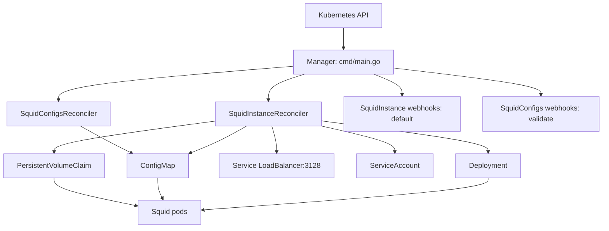

# Overview

The Squid Operator is a controller-runtime manager hosting two reconcilers and two admission
webhooks, all serving the `squid.cdk.clara.net/v1` API group.

## Core concepts

| Kind            | Role                                                                                   |
| --------------- | -------------------------------------------------------------------------------------- |
| `SquidInstance` | The runtime. Owns Deployment, Service, ServiceAccount, ConfigMap and PVC.               |
| `SquidConfigs`  | A fragment of `squid.conf`, merged into one key of the target instance's ConfigMap.     |

The link between them is the annotation `squid.ckd.clara.net/instance` on the `SquidConfigs` object,
naming a `SquidInstance` in the same namespace. There is no owner reference and no spec field for it:
a `SquidConfigs` is not garbage-collected with its instance.

## Architecture

## How it works

### Instance reconciliation

`SquidInstanceReconciler` reconciles a fixed list of five managed resources, each built by a pure
function in `pkg/squid/` and each named after the instance:

1. On first sight, the finalizer `squid.ckd.clara.net/finalizer` is added and the request requeued.
2. On every reconcile, each managed resource is fetched by `{namespace, name}`; missing ones are
   created with a controller reference, existing ones are updated.
3. `status.health` is set to `Done`, or `Error` if any resource failed.
4. On deletion, the five resources are deleted, then the finalizer is removed.

Update behaviour differs per resource type, deliberately:

| Resource         | On update                                                                        |
| ---------------- | -------------------------------------------------------------------------------- |
| `ConfigMap`      | Skipped — would wipe the merged `SquidConfigs` keys                              |
| `PVC`            | Skipped — most PVC fields are immutable and it holds the logs                    |
| `Deployment`     | Pod template annotated `squid-operator.kubernetes.io/restartedAt`, forcing a roll |
| `Service`        | Load balancer ingress copied into `status.loadBalancer` when present             |
| `ServiceAccount` | Plain update                                                                     |

### Configuration merge

`SquidConfigsReconciler` reads the target ConfigMap named by the annotation, then merges
`spec.rules` into the key `<squidconfigs-name>.conf`:

- Identical content already present is reported as a duplicate instead of rewritten.
- If the object is being deleted, the key is removed and the finalizer cleared.
- `status.state` becomes `Merged`, `Applying`, `Deletion` or `Failed`.

### Rollout

The instance controller also watches ConfigMaps. When a ConfigMap whose **name matches a
SquidInstance name** changes, the matching instance is enqueued; the Deployment update path then
stamps `restartedAt` and the pods roll, which is how new rules reach a running proxy.

!!! note
    That watch is cluster-wide and matches on name only, so a ConfigMap with the same name in a
    different namespace also enqueues the instance. Harmless — reconciliation is idempotent — but it
    causes extra rollouts.

### Admission

- `SquidInstance` — mutating webhook fills in image defaults (`ubuntu/squid:latest`) and
  `storageClassName: standard`. Validation is a no-op.
- `SquidConfigs` — validating webhook parses the rules with `squid -k parse` inside a `Job` built
  from the target instance's image, and refuses deletion while the rules are still in the ConfigMap.
  Its mutating webhook is a no-op.

## Key features

- **Declarative Squid** through custom resources
- **Composable configuration**: one ConfigMap key per `SquidConfigs`
- **Syntax validation at admission time**, using the same Squid build that will run the config
- **Finalizer-based cleanup** for both kinds

## Not implemented

- `spec.hpaSpec` is part of the API but no HPA is reconciled
- No Ingress, no TLS termination by the operator, no Squid metrics exporter
- Pod resources, ports, PVC size and access mode are hardcoded in `pkg/squid/`

## Next steps

- [Components](components.md) — code-level component map
- [Workflow](workflow.md) — step-by-step create / update / delete flows
- [Networking](networking.md) — proxy, webhook and metrics traffic
