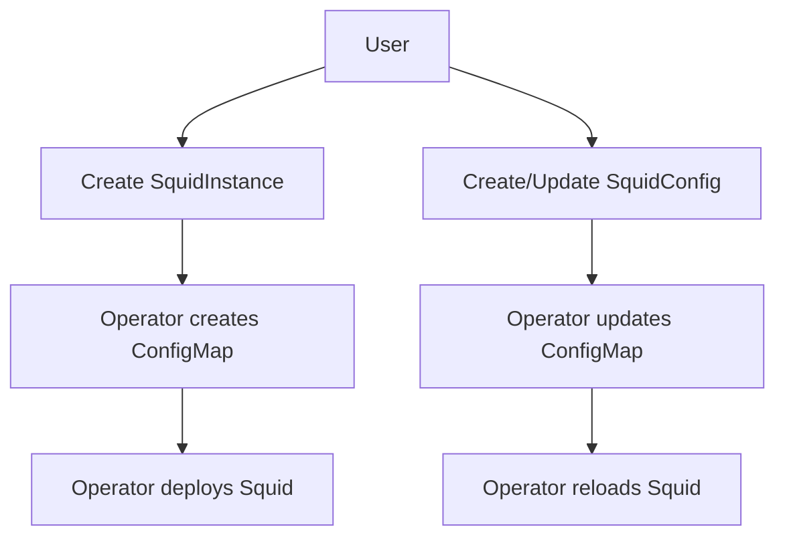
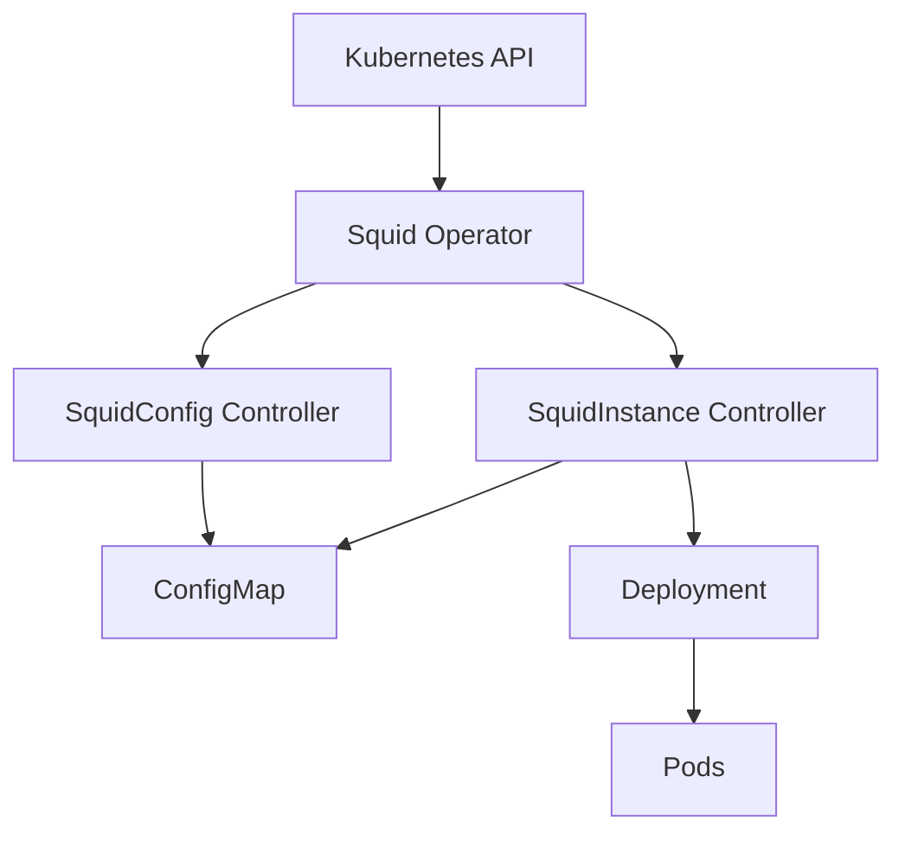

# Overview

The Squid Operator is a Kubernetes operator that simplifies the deployment and management of Squid proxy instances in your Kubernetes cluster.

## Core Concepts

The operator is built around two main concepts:

1. **SquidConfig**: Defines the configuration for Squid proxy instances
2. **SquidInstance**: Manages the actual Squid proxy deployment

## Simple Workflow

## How It Works

1. **Initial Setup**
   - User creates a SquidInstance
   - Operator creates a ConfigMap
   - Operator deploys the Squid proxy

2. **Configuration Management**
   - User creates/updates SquidConfig
   - Operator updates the ConfigMap
   - Operator triggers Squid reload

3. **Resource Management**
   - Operator manages all Kubernetes resources
   - Handles updates and rollbacks
   - Maintains desired state

## Key Features

- **Declarative Configuration**: Manage Squid through Kubernetes custom resources
- **Configuration Management**: Separate configuration from instance deployment
- **Resource Management**: Automatic handling of Kubernetes resources
- **Security**: Built-in support for TLS and network policies

## Architecture

## Next Steps

- [Workflow](workflow.md) - Detailed workflow between components
- [Components](components.md) - Component descriptions
- [Configuration](../user-guide/configuration.md) - How to configure the operator
