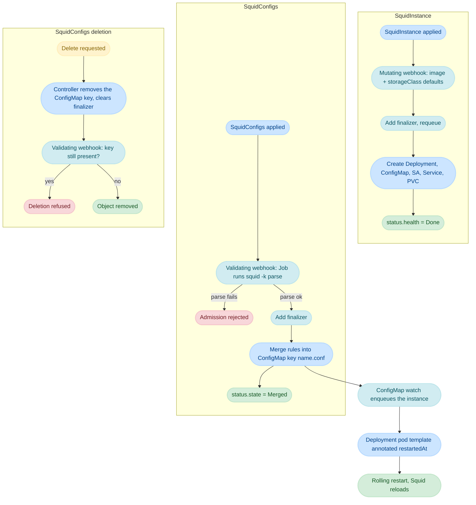

# Workflow

How `SquidInstance` and `SquidConfigs` interact, step by step.

## Resource interaction



## 1. SquidInstance creation

```yaml
apiVersion: squid.cdk.clara.net/v1
kind: SquidInstance
metadata:
  name: squid-sample
  namespace: healthcare-tools
spec:
  replicas: 1
  image:
    repository: ubuntu/squid
    tag: latest
  storageClassName: standard
```

1. The API server validates the object against the CRD schema: `replicas`, `image` and
   `storageClassName` are all required.
2. The mutating webhook fills defaults for `storageClassName` (`standard`) when empty. The
   validating webhook accepts everything.
3. First reconcile: the controller appends `squid.ckd.clara.net/finalizer` and requeues — no child
   resources are created in that pass.
4. Second reconcile: for each of the five managed resources, `Get` by `{namespace, instance-name}`;
   `NotFound` → `Create` with a controller reference and a `Normal`/`Created` event; otherwise
   `Update` with a `Normal`/`Updated` event.
5. `status.health` is set to `Done`, or `Error` if any resource failed. Conflicts on the status
   update requeue instead of erroring.

All five children share the instance's name and namespace. That naming is what ties the pieces
together — the Deployment mounts the ConfigMap and PVC by that name, and the ConfigMap watch matches
on it.

## 2. SquidConfigs creation or update

```yaml
apiVersion: squid.cdk.clara.net/v1
kind: SquidConfigs
metadata:
  name: allow-localnet
  namespace: healthcare-tools
  annotations:
    squid.ckd.clara.net/instance: squid-sample
spec:
  rules: |
    acl localnet src 10.0.0.0/8
    http_access allow localnet
```

1. **Admission** — the validating webhook:
    - requires the `squid.ckd.clara.net/instance` annotation
      (`missing annotation squid.ckd.clara.net/instance` otherwise);
    - reads the target `SquidInstance` to learn which image to validate against;
    - creates `validate-allow-localnet-<suffix>`, a `Job` that writes the rules to
      `/etc/squid/conf.d/00-squid.conf` and runs `squid -k parse`;
    - polls every 5s, up to 2 minutes; `Failed > 0` → `validation job failed` and the request is
      rejected.
2. **Reconcile** — first pass adds the finalizer. Then the controller reads the ConfigMap named by
   the annotation and merges `spec.rules` into `allow-localnet.conf`.
3. **Rollout** — the ConfigMap update wakes the instance controller through its ConfigMap watch, the
   Deployment pod template gets a fresh `squid-operator.kubernetes.io/restartedAt` timestamp, and
   the pods roll.
4. `status.state` becomes `Merged`.

Submitting the exact same rules again yields the internal duplicate error rather than a rewrite, so
no pointless rollout happens.

!!! warning
    The webhook fetches the target instance but the **controller** only fetches the ConfigMap. If the
    annotation names something that exists as a ConfigMap but not as a `SquidInstance`, admission
    fails; if the instance exists but its ConfigMap has not been created yet, the reconcile errors
    and retries. Create the instance first, then its fragments.

## 3. SquidConfigs deletion

1. `kubectl delete` sets `deletionTimestamp` — the finalizer keeps the object alive.
2. The controller reconciles with `truncate = true`: the key `<name>.conf` is deleted from the
   ConfigMap, `status.state` becomes `Deletion` and the finalizer list is cleared.
3. The validating delete webhook re-reads the ConfigMap. If `<name>.conf` is still there, deletion is
   refused with `configmap <cm> still contains the following rules <key>`; otherwise the object is
   removed.
4. The ConfigMap change triggers a rollout, so the proxy drops the rules.

## 4. SquidInstance deletion

1. `deletionTimestamp` is set; the finalizer holds the object.
2. The controller deletes each of the five managed resources that still exist (`NotFound` is
   skipped), then removes the finalizer.
3. Deleting the ConfigMap discards every merged fragment. The `SquidConfigs` objects themselves are
   **not** deleted — they have no owner reference to the instance — and will error on their next
   reconcile until the instance (and its ConfigMap) exists again, or they are deleted.

## Status reference

`SquidInstance`:

| Field                  | Values                                                                    |
| ---------------------- | ------------------------------------------------------------------------- |
| `status.health`        | `Done`, `Error` (the API also defines `Pending`, `Deployed`, `Merged`, currently unused) |
| `status.loadBalancer`  | Copied from the `Service` once the load balancer reports ingress          |

`SquidConfigs`:

| Field          | Values                                          |
| -------------- | ----------------------------------------------- |
| `status.state` | `Merged`, `Applying`, `Deletion`, `Failed`      |

Neither kind uses `metav1.Condition`; there is no `Ready` condition to wait on. Use the printer
columns (`kubectl get squidinstance`, `kubectl get squidconfigs`) and the emitted events.

## Best practices

1. **Ordering** — create the `SquidInstance` before any `SquidConfigs` targeting it, and keep them in
   the same namespace.
2. **One concern per fragment** — one `SquidConfigs` per rule set, named for what it does; the name
   becomes the ConfigMap key and shows up in `squid -k parse` errors.
3. **Deletion** — delete fragments before their instance, so the merge/unmerge path can run while the
   ConfigMap still exists.
4. **Admission budget** — the 2-minute validation window includes pulling the Squid image. Pre-pull
   it or use a local registry mirror on busy clusters.
5. **Validation Jobs** — expect one `Job` per create/update. Configure a `ttlSecondsAfterFinished`
   default or prune them periodically.

## Next steps

- [Components](components.md) — the code behind each step
- [Configuration](../user-guide/configuration.md) — writing rules
- [Monitoring](../user-guide/monitoring.md) — watching status and events
