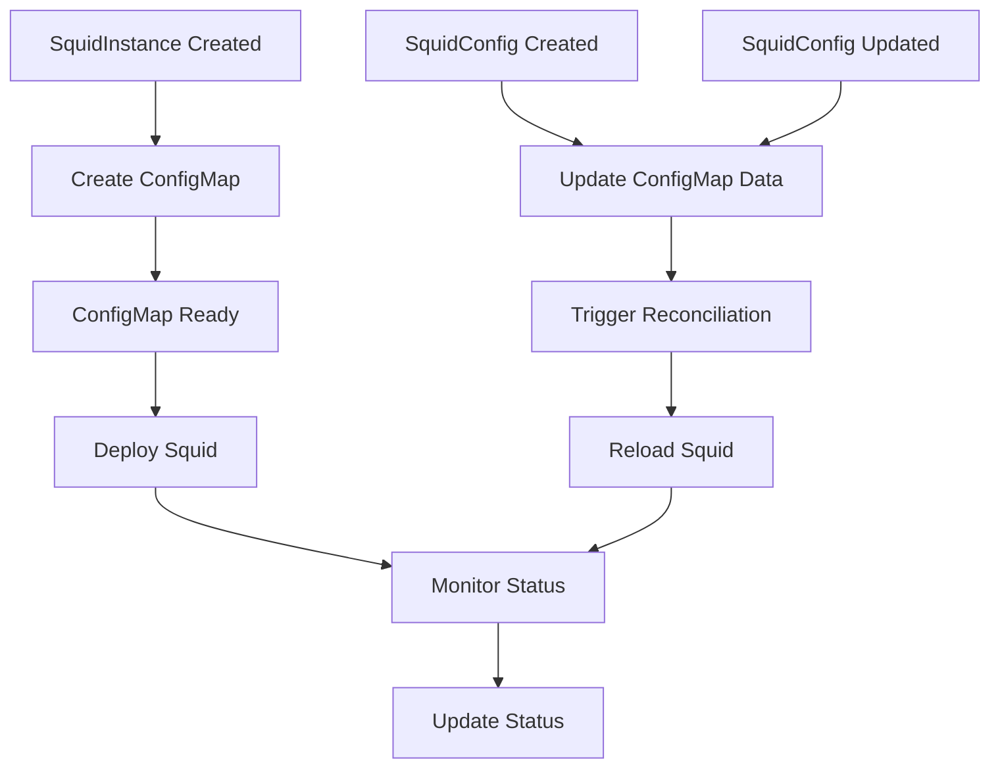

# SquidConfig and SquidInstance Workflow

This document explains how SquidConfigs and SquidInstances interact within the Squid Operator.

## Resource Interaction

The Squid Operator manages two main custom resources:

1. **SquidConfig**: Defines the configuration for Squid proxy instances
2. **SquidInstance**: Manages the actual Squid proxy deployment

## Workflow Diagram



## Detailed Workflow

### 1. SquidInstance Creation

When a SquidInstance is created:

1. The operator creates a ConfigMap for the Squid configuration
2. Creates the necessary Kubernetes resources
3. Deploys the Squid proxy with the configuration

```yaml
apiVersion: squid.claranet.fr/v1
kind: SquidInstance
metadata:
  name: my-squid
  namespace: squid-proxy
spec:
  replicas: 1
  image:
    repository: squid
    tag: latest
```

### 2. SquidConfig Creation/Update

When a SquidConfig is created or updated:

1. The operator updates the data in the existing ConfigMap
2. Triggers reconciliation of the affected SquidInstance
3. Reloads the Squid configuration in the running pods

```yaml
apiVersion: squid.claranet.fr/v1
kind: SquidConfig
metadata:
  name: my-squid-config
  namespace: squid-proxy
spec:
  config: |
    http_port 3128
    acl SSL_ports port 443
    acl Safe_ports port 80
```

### 3. Configuration Updates

When a SquidConfig is updated:

```go
func (r *SquidInstanceReconciler) handleConfigUpdate(ctx context.Context, instance *v1.SquidInstance) error {
    // Get the ConfigMap
    configMap := &corev1.ConfigMap{}
    if err := r.Get(ctx, types.NamespacedName{
        Name:      instance.Spec.ConfigMapName,
        Namespace: instance.Namespace,
    }, configMap); err != nil {
        return err
    }

    // Update Squid configuration
    if err := r.updateSquidConfig(ctx, instance, configMap); err != nil {
        return err
    }

    return nil
}
```

### 4. Status Management

The operator maintains status information for both resources:

```go
type SquidConfigStatus struct {
    Conditions []metav1.Condition `json:"conditions,omitempty"`
    Phase      ConfigPhase       `json:"phase,omitempty"`
}

type SquidInstanceStatus struct {
    Conditions []metav1.Condition `json:"conditions,omitempty"`
    Health     StatusPhase        `json:"health,omitempty"`
}
```

## Best Practices

1. **Configuration Management**
   - Use separate SquidConfigs for different environments
   - Version control your configurations
   - Test configurations before applying

2. **Instance Management**
   - Create instances in the same namespace as their configs
   - Monitor instance health
   - Use appropriate resource limits

3. **Updates**
   - Plan configuration changes
   - Test updates in staging
   - Monitor for issues

## Next Steps

- [API Reference](../reference/api.md) - Detailed API documentation
- [Configuration](../user-guide/configuration.md) - Configuration options
- [Monitoring](../user-guide/monitoring.md) - Monitoring setup
